1.Install CentOS /RHEL

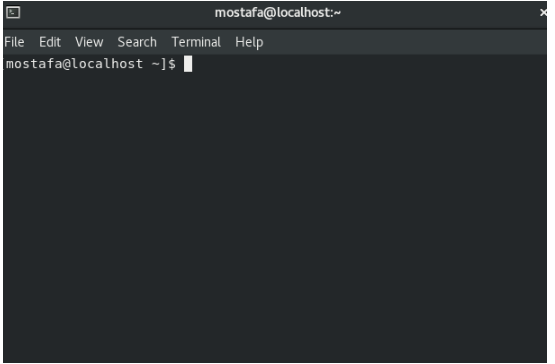

2.What is the difference between cat and more command?

cat will show the whole file at once. more will show it chunk by chunck.

More

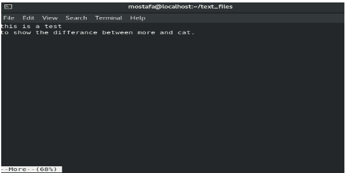

cat

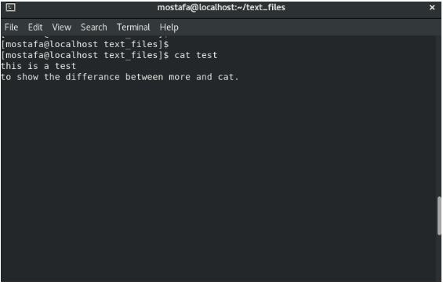

3.What is the difference between rm and rmdir using man?

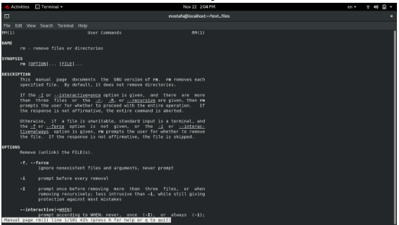

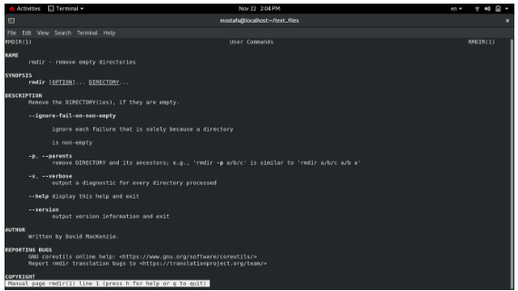

4.Create the following hierarchy under your home directory:

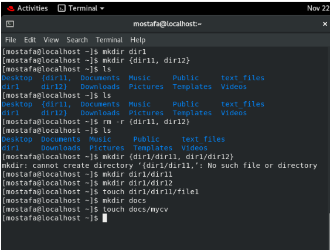

a. Remove dir11 in one-step. What did you notice? And how did you overcome that?

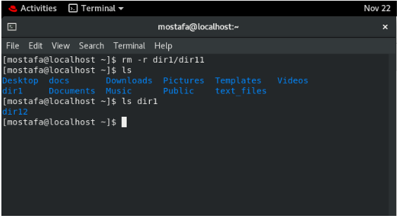

b. Then remove dir12 using rmdir –p command. State what happened to the

hierarchy (Note: you are in your home directory).

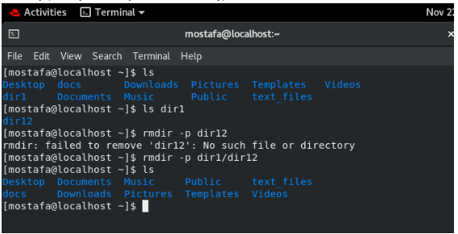

c. The output of the command pwd was /home/user. Write the absolute

and relative path for the file mycv

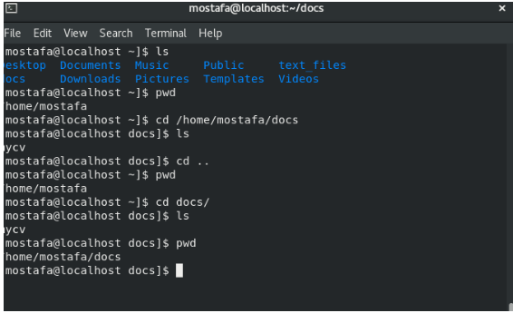

5. Copy the /etc/passwd file to your home directory making its name is mypasswd.

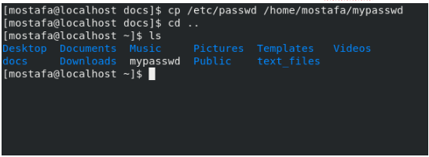

6. Rename this new file to be oldpasswd.

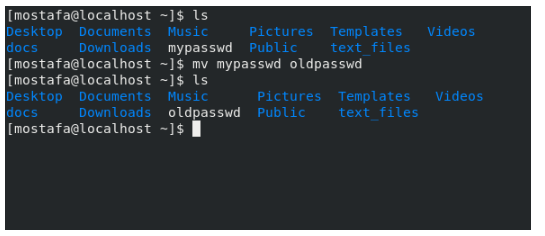

7. You are in /usr/bin, list four ways to go to your home directory

cd ~

cd /home/mostafa

cd - (if i were at the home dir before)

cd /home; cd mostafa

8. List Linux commands in /usr/bin that start with letter w

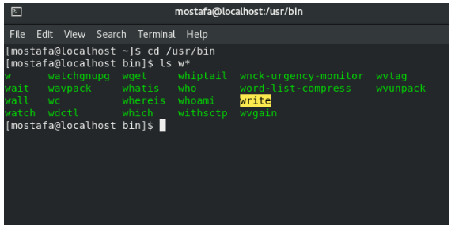

9. Display the first 4 lines of /etc/passwd

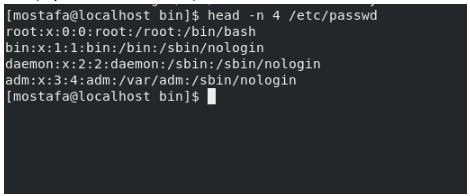

10. Display the last 7 lines of /etc/passwd

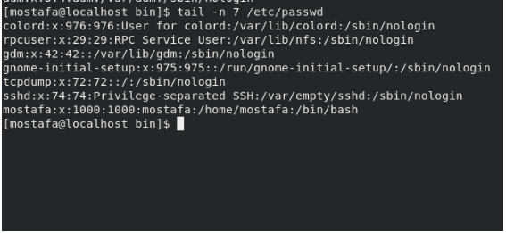

11. Display the man pages of passwd the command and the file sequentially in one command.

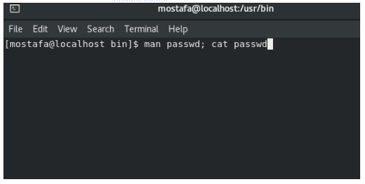

12. Display the man page of the passwd file.

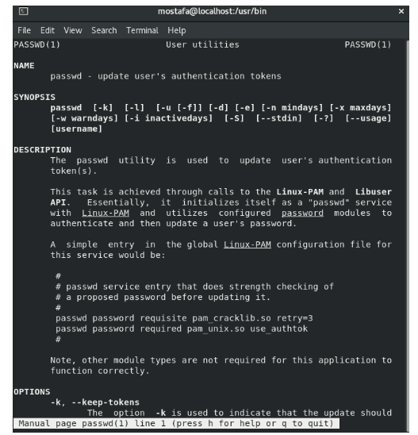

13. Display a list of all the commands that contain the keyword passwd in their man page.

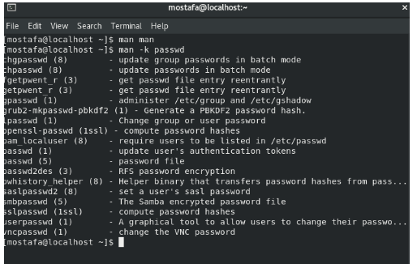

