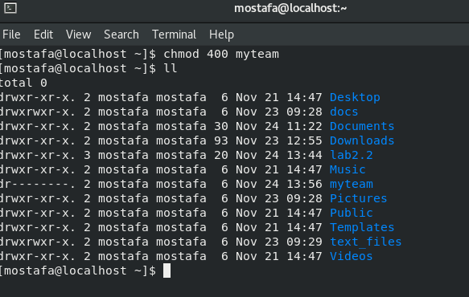
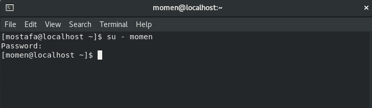
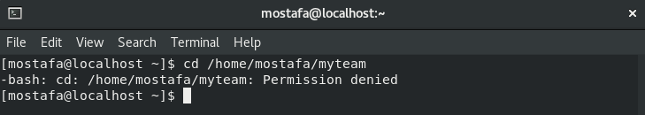
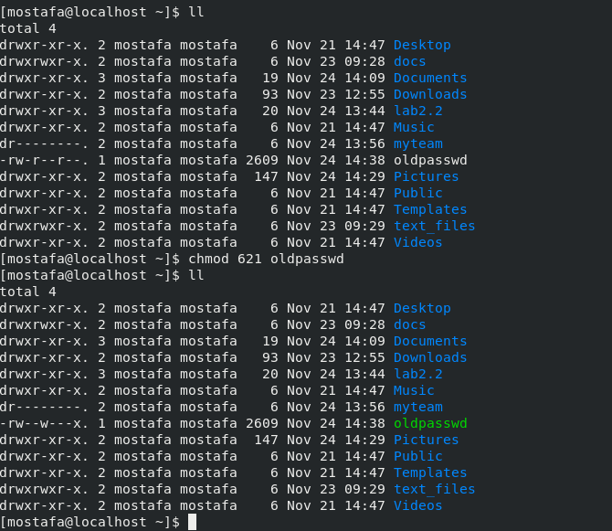
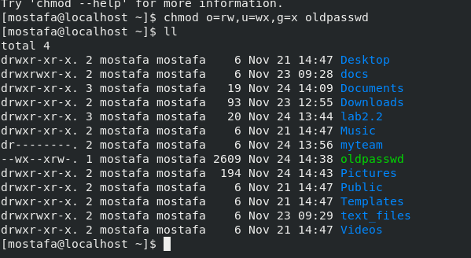
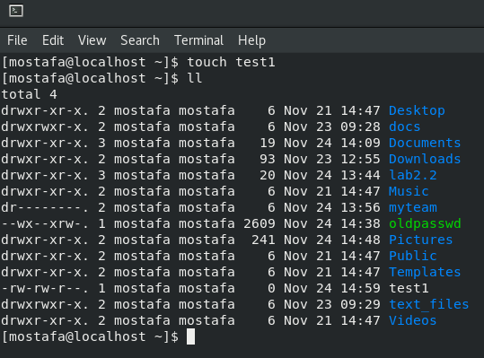
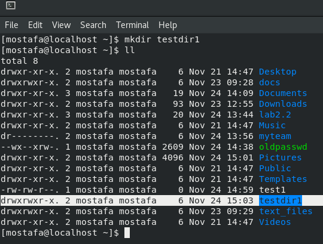
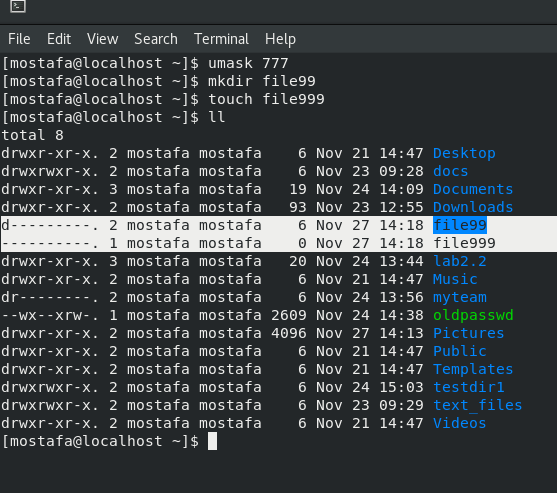
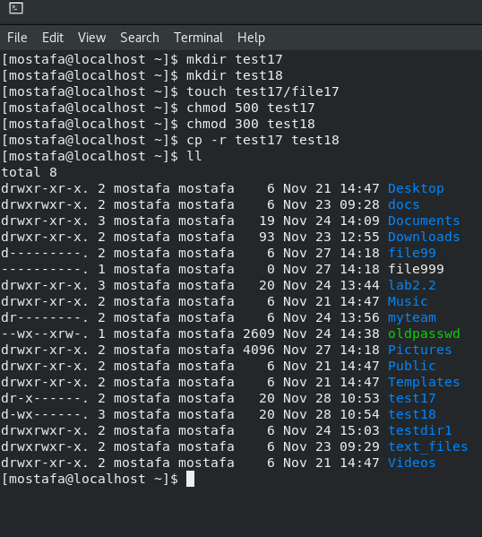
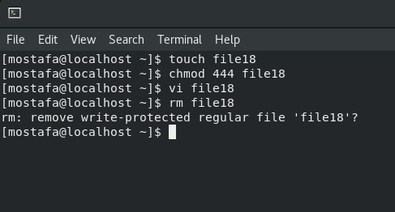

Create a folder called myteam in your home directory and change its permissions to

read only for the owner.

Log out and log in by another user

Try to access (by cd command) the folder (myteam)

Using the command Line

Change the permissions of oldpasswd file to give owner read and write

permissions and for group write and execute and execute only for the others

(using chmod in 2 different ways)

What is the maximum permission a file can have, by default when it is just

created? 

**File -> -rw-rw-r—**

And what is that for directory.

Change your default permissions to be no permission to everyone then create a

directory and a file to verify.

Made with by 2

17. What are the minimum permission needed for:

Copy a directory (permission for source directory and permissions for target

parent directory)

Copy a file (permission for source file and and permission for target parent

directory)

Create a file with permission 444. Try to edit in it and to remove it? Note what happened

What is the difference between the “x” permission for a file and for a directory?

 Execute permission on files means the right to execute them, if they are programs. For directories, execute permission allows you to enter the directory and to access any of its files

