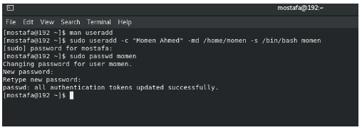
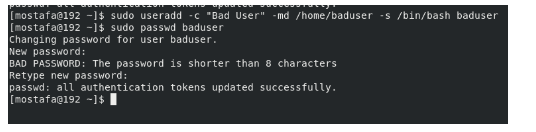
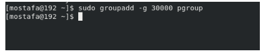
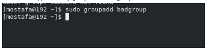
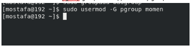
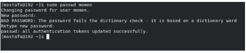
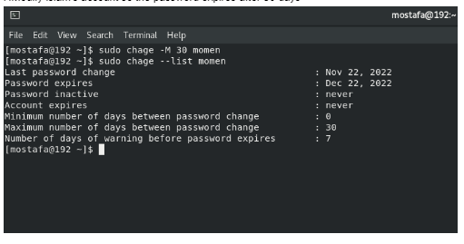
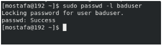
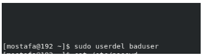
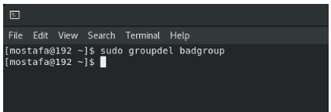

1. Create a user account with the following attribute

username: islam

Fullname/comment: Islam Askar

Password: islam

2.Create a user account with the following attribute

Username: baduser

Full name/comment: Bad User

Password: baduser

3.Create a supplementary (Secondary) group called pgroup with group ID of 30000

4.Create a supplementary group called badgroup

5.Add islam user to the pgroup group as a supplementary group

6.Modify the password of islam's account to password

7.Modify islam's account so the password expires after 30 days

8.Lock bad user account so he can't log in

9.Delete bad user account

10. Delete the supplementary group called badgroup.

