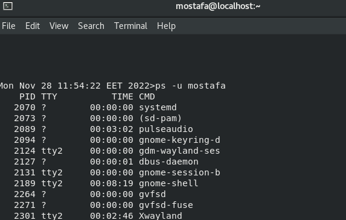

List the user commands and redirect the output to /tmp/commands.list

Count the number of user commands

Get all the users names whose first character in their login is ‘g’.

Get the logins name and full names (comment) of logins starts with “g”.

Save the output of the last command sorted by their full names in a file.

Write two commands: first: to search for all files on the system that named

.bash_profile.

Second: sorts the output of ls command on / recursively, Saving

their output and error in 2 different files and sending them to the background.

Display the number of users who is logged now to the system.

8. Display lines 7 to line 10 of /etc/passwd file

9. What happens if you execute:

cat filename1 | cat filename2

filename 2 will be shown to the terminal

ls | rm

Rm missing operand

ls /etc/passwd | wc –l

1 (number of lines)

10.Issue the command sleep 100.

11.Stop the last command.

12.Resume the last command in the background

13.Issue the jobs command and see its output.

14.Send the sleep command to the foreground and send it again to the background.

15.Kill the sleep command.

16.Display your processes only

17.Display all processes except yours

18.Use the pgrep command to list your processes only

19.Kill your processes only.

11. Create a symbolic link of /etc/passwd in /boot.

12. Create a hard link of /etc/passwd in /boot. Could you? Why?

